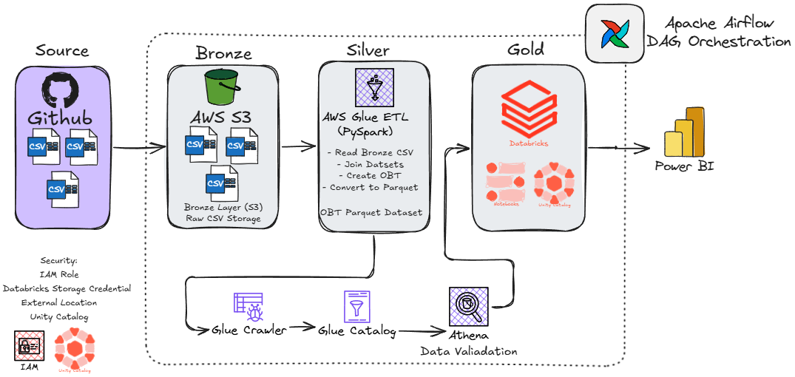
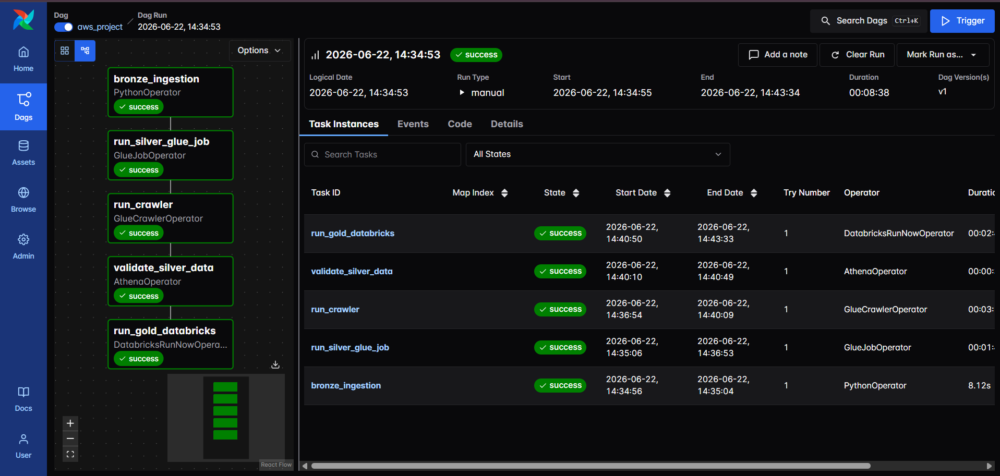
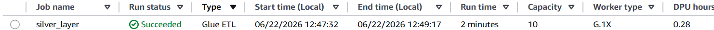
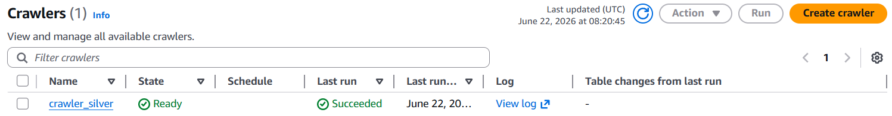
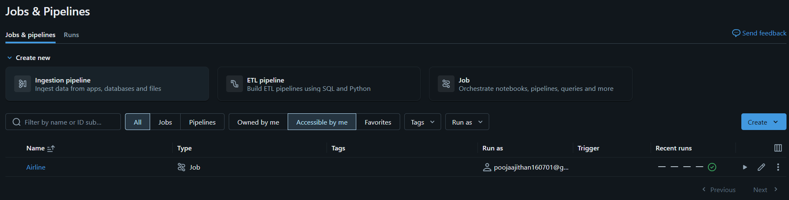
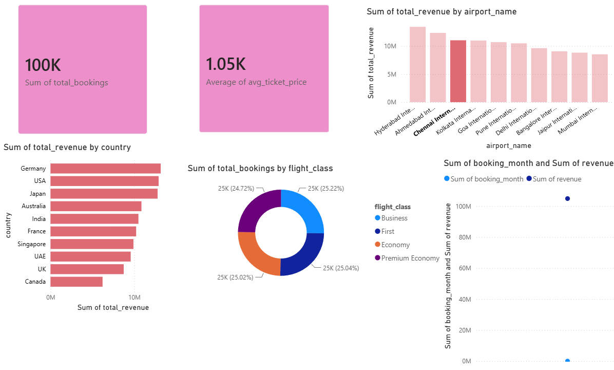

# AWS Airline Medallion Data Platform

End-to-End AWS Data Engineering Project implementing the Medallion Architecture (Bronze → Silver → Gold) using Apache Airflow, AWS S3, AWS Glue, Athena, Databricks, and Power BI.

---

## Project Overview

This project demonstrates how modern data platforms are built using cloud-native services and orchestration tools.

The pipeline ingests airline booking datasets from GitHub, stores raw data in Amazon S3 Bronze Layer, transforms data into an analytical One Big Table (OBT) using AWS Glue, validates data through Athena, creates Gold business aggregates in Databricks, and visualizes KPIs using Power BI.

The entire workflow is orchestrated using Apache Airflow running inside Docker.

---

## Architecture



---

## Tech Stack

| Layer            | Technology              |
| ---------------- | ----------------------- |
| Orchestration    | Apache Airflow          |
| Storage          | Amazon S3               |
| Processing       | AWS Glue (PySpark)      |
| Metadata         | Glue Data Catalog       |
| Query Engine     | Amazon Athena           |
| Analytics        | Databricks Free Edition |
| Visualization    | Power BI                |
| Testing          | Pytest                  |
| Containerization | Docker                  |
| Language         | Python                  |
| Data Format      | CSV, Parquet            |

---

## Medallion Architecture

### Bronze Layer

Purpose:

Store raw source files without modifications.

Source Files:

* bookings.csv
* airports.csv
* passengers.csv

Storage:

```text
s3://pooja-airline-data-platform/bronze/
```

---

### Silver Layer

Purpose:

Create cleaned and joined analytical dataset.

Transformations:

* Read raw CSV files
* Join bookings
* Join passengers
* Join airports
* Create OBT (One Big Table)
* Convert CSV → Parquet

Storage:

```text
s3://pooja-airline-data-platform/silver/obt/
```

Output:

100,000 airline booking records

---

### Gold Layer

Purpose:

Create business-ready aggregates.

Generated Tables:

| Table                  | Description              |
| ---------------------- | ------------------------ |
| revenue_by_country     | Revenue by country       |
| revenue_by_airport     | Revenue by airport       |
| flight_class_summary   | Bookings by flight class |
| monthly_booking_trends | Monthly trends           |

Storage:

Databricks Unity Catalog

Schema:

```text
workspace.gold
```

---

## Airflow DAG

Workflow:

```text

bronze_ingestion
        │
        ▼
run_silver_glue_job
        │
        ▼
run_crawler
        │
        ▼
validate_silver_data
        │
        ▼
run_gold_databricks

```



### Tasks

#### bronze_ingestion

Downloads datasets from GitHub and uploads them to S3 Bronze Layer.

#### run_silver_glue_job

Triggers AWS Glue ETL job.

Job Name:

```text
silver_layer
```



#### run_crawler

Updates Glue Data Catalog metadata.

Crawler Name:

```text
crawler_silver
```



#### validate_silver_data

Runs Athena validation query.

Validation:

```sql
SELECT COUNT(*)
FROM airline_db.obt;
```

Expected Result:

```text
100000
```

#### run_gold_databricks

Triggers Databricks Job.

Job Name:

```text
Airline
```



---

## Project Structure

```text

├── aws-medallion-data-platform
│   ├── architecture
│   │   ├── airflow_success.png
│   │   ├── architecture.png
│   │   ├── crawler_success.png
│   │   ├── databricks.png
│   │   ├── glue_job_success.png
│   │   └── powerbi_dashboard.png
│   ├── athena
│   │   └── athena.sql
│   ├── config
│   │   ├── airflow.env.example
│   │   └── aws_config_example.json
│   ├── dags
│   │   └── aws_project.py
│   ├── datasets
│   │   ├── airports.csv
│   │   ├── bookings.csv
│   │   └── passengers.csv
│   ├── glue_jobs
│   │   ├── silver_layer.py
│   │   └── silver_layer_athena.py
│   ├── logs
│   │   ├── dag_id=aws_project
│   │   └── dag_processor
│   ├── notebooks
│   │   └── gold_layer.ipynb
│   ├── plugins
│   ├── scripts
│   │   └── delete_resources.sh
│   ├── tests
│   │   ├── test_bronze.py
│   │   ├── test_data_quality.py
│   │   └── test_s3_upload.py
│   ├── utils
│   │   ├── __init__.py
│   │   ├── bronze_layer.py
│   │   ├── dataset_generator.py
│   │   ├── gold_layer.py
│   │   └── silver_layer.py
│   ├── Dockerfile
│   ├── README.md
│   ├── docker-compose.yml
│   └── requirements.txt
```

---

## Gold Layer Analytics

### Revenue by Country

Top Performing Countries:

* Germany
* USA
* Japan
* Australia
* India

---

### Revenue by Airport

Top Airports:

* Hyderabad International Airport
* Ahmedabad International Airport
* Chennai International Airport

---

### Flight Class Distribution

Classes:

* Business
* First
* Economy
* Premium Economy

---

### Monthly Booking Trends

Generated using booking date aggregation.

---

## Power BI Dashboard

Dashboard Features:

* Total Bookings KPI
* Average Ticket Price KPI
* Revenue by Country
* Revenue by Airport
* Flight Class Distribution
* Monthly Revenue Trends



---

## Security

Implemented Security Components:

* IAM Roles
* Glue Execution Role
* S3 Bucket Permissions
* Databricks Storage Credential
* Databricks External Location
* Unity Catalog Access Controls

---

## Testing

Run Tests

```bash
pytest tests/
```

Implemented Tests:

* Bucket Validation
* Null Checks
* Data Quality Checks
* Positive Ticket Price Validation

---

## Running Locally

### Clone Repository

```bash
git clone <repo-url>
cd aws-medallion-data-platform
```

### Start Airflow

```bash
docker compose up -d
```

### Open Airflow

```text
http://localhost:8080
```

### Trigger DAG

```text
aws_project
```

---

## Cleanup Resources

```bash
bash scripts/delete_resources.sh
```

---

## Key Achievements

* Built Medallion Architecture on AWS
* Orchestrated ETL using Apache Airflow
* Processed data with AWS Glue and Spark
* Created analytical OBT dataset
* Automated Data Catalog updates
* Validated datasets using Athena
* Built Gold Layer using Databricks
* Created Power BI business dashboard
* Implemented automated testing
* Dockerized orchestration environment

---

## Future Enhancements

* CI/CD using GitHub Actions
* Terraform Infrastructure as Code
* Data Quality Monitoring with Great Expectations
* Incremental Processing using Glue Bookmarks
* Real-Time Streaming using Kafka
* Lakehouse Implementation with Delta Lake

---

## Author

Pooja 

---